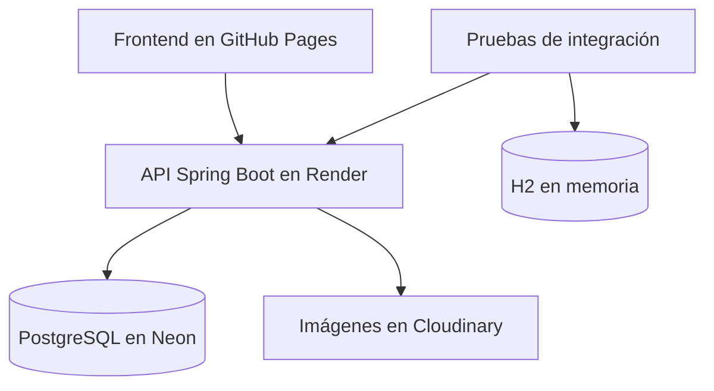
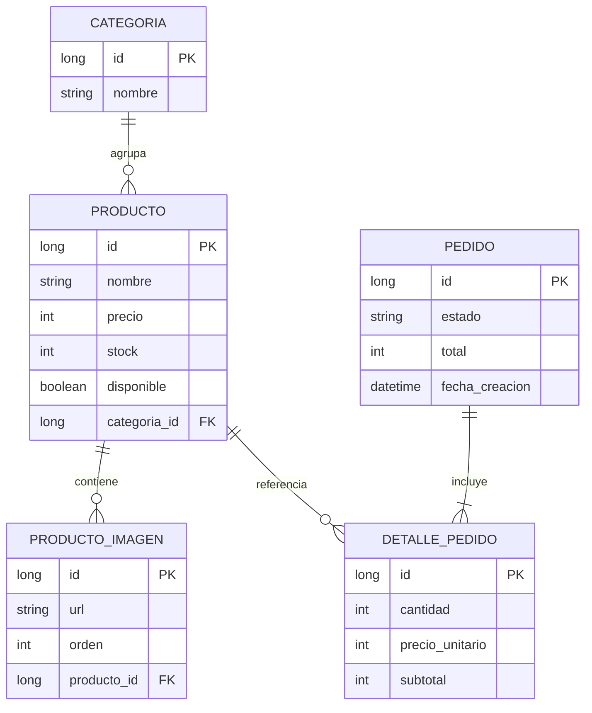
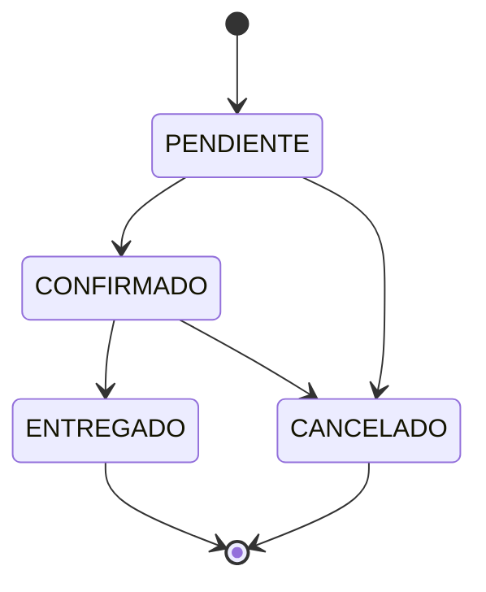

<h1 align="center">BeaGi Backend</h1>

<p align="center">
  API REST para administrar el catálogo, las imágenes, el stock y los pedidos de BeaGi ModaCircular.
</p>

<p align="center">
  <a href="https://beagi-backend.onrender.com/api/productos"><strong>Ver API</strong></a>
  ·
  <a href="https://mateocuetoc-hub.github.io/BeaGi-ModaCircular/"><strong>Ver tienda</strong></a>
  ·
  <a href="https://github.com/mateocuetoc-hub/BeaGi-ModaCircular"><strong>Repositorio frontend</strong></a>
</p>

<p align="center">
  
  
  
  
  
</p>

## Sobre el proyecto

**BeaGi Backend** es la API de una plataforma full stack creada para una pyme de moda circular de San Felipe, Chile. Centraliza la información que utiliza la tienda pública y permite administrar productos, categorías, fotografías, stock y pedidos desde un panel protegido.

El proyecto comenzó como un CRUD de productos y evolucionó hasta incorporar persistencia real, reglas de negocio transaccionales, autenticación administrativa, almacenamiento de imágenes y despliegue en producción.

La solución completa utiliza:

- **GitHub Pages** para el frontend.
- **Render** para ejecutar la API.
- **Neon PostgreSQL** para persistir la información.
- **Cloudinary** para almacenar las fotografías de los productos.

## Funcionalidades

### Productos y categorías

- CRUD completo de productos y categorías.
- Asociación de cada producto con una categoría.
- Validación de nombre, precio, stock, disponibilidad y categoría.
- Atributos comerciales como talla, estado, novedad y producto destacado.
- Respuestas `404 Not Found` para recursos inexistentes.
- Eliminación en cascada de las imágenes asociadas a un producto.

### Imágenes de productos

- Asociación de varias imágenes ordenadas a un mismo producto.
- Carga directa de archivos mediante `multipart/form-data`.
- Almacenamiento externo en Cloudinary mediante URL segura.
- Máximo de cinco imágenes por producto.
- Formatos permitidos: JPG, PNG y WebP.
- Tamaño máximo de 8 MB por archivo y 40 MB por solicitud.
- Validación previa antes de almacenar una imagen.

### Pedidos y stock

- Creación de pedidos con uno o más productos.
- Registro de datos del cliente y observaciones.
- Cálculo de subtotales y total exclusivamente en el servidor.
- Conservación del precio unitario utilizado al crear el pedido.
- Descuento automático de stock.
- Rechazo de productos inexistentes o cantidades sin stock suficiente.
- Rollback transaccional si falla cualquier detalle del pedido.
- Consulta de pedidos y filtro opcional por estado.
- Flujo controlado de estados: `PENDIENTE`, `CONFIRMADO`, `ENTREGADO` y `CANCELADO`.
- Reposición automática del stock al cancelar un pedido pendiente o confirmado.
- Bloqueo de transiciones inválidas mediante `409 Conflict`.

### Seguridad

- Autenticación HTTP Basic para las operaciones administrativas.
- API sin sesiones mediante una política `STATELESS`.
- Credenciales obtenidas desde variables de entorno.
- Endpoints públicos limitados a la lectura del catálogo y creación de pedidos.
- CORS configurado para GitHub Pages y entornos de desarrollo locales.
- Trazas y excepciones internas ocultas en las respuestas de producción.

> [!IMPORTANT]
> Las credenciales de administración, PostgreSQL y Cloudinary no se almacenan en el repositorio. Deben configurarse mediante variables de entorno.

## Arquitectura



La aplicación sigue una arquitectura por capas: los controladores reciben las solicitudes, los servicios ejecutan la lógica de negocio y los repositorios administran la persistencia. La integración con Cloudinary se encapsula en un servicio especializado.

| Capa | Responsabilidad |
| --- | --- |
| Controller | Recibir solicitudes HTTP y construir las respuestas de la API |
| DTO | Definir y validar los datos de entrada |
| Service | Ejecutar reglas de negocio y operaciones transaccionales |
| Repository | Acceder a los datos mediante Spring Data JPA |
| Model | Representar las entidades y sus relaciones |
| Exception | Traducir errores de validación y negocio a respuestas HTTP |
| Config | Configurar seguridad, CORS, Cloudinary y componentes de Spring |

## Modelo de datos



## Tecnologías

| Área | Tecnologías |
| --- | --- |
| Lenguaje y framework | Java 21, Spring Boot 4.1 |
| API | Spring Web MVC, REST y JSON |
| Persistencia | Spring Data JPA, Hibernate y PostgreSQL |
| Validación | Jakarta Validation y DTOs |
| Seguridad | Spring Security y HTTP Basic |
| Imágenes | Cloudinary y carga multipart |
| Pruebas | JUnit 5, MockMvc, Mockito y H2 |
| Construcción | Maven Wrapper |
| Despliegue | Docker, Render y Neon PostgreSQL |
| Control de versiones | Git y GitHub |

## Estructura principal

```text
beagi-backend/
├── .mvn/                           # Maven Wrapper
├── src/
│   ├── main/
│   │   ├── java/cl/mateocuetoc/beagibackend/
│   │   │   ├── config/             # Seguridad, CORS y Cloudinary
│   │   │   ├── controller/         # Endpoints REST
│   │   │   ├── dto/                # Solicitudes y validaciones
│   │   │   ├── exception/          # Errores de negocio y manejadores
│   │   │   ├── model/              # Entidades JPA
│   │   │   ├── repository/         # Acceso a datos
│   │   │   ├── service/            # Lógica de negocio
│   │   │   └── BeagiBackendApplication.java
│   │   └── resources/
│   │       └── application.properties
│   └── test/
│       ├── java/                    # Pruebas unitarias y de integración
│       └── resources/
│           └── application-test.properties
├── Dockerfile
├── mvnw
├── mvnw.cmd
├── pom.xml
└── README.md
```

## Endpoints

### Categorías

| Método | Endpoint | Acceso | Descripción |
| --- | --- | --- | --- |
| `GET` | `/api/categorias` | Público | Listar categorías |
| `GET` | `/api/categorias/{id}` | Público | Buscar una categoría |
| `POST` | `/api/categorias` | Admin | Crear una categoría |
| `PUT` | `/api/categorias/{id}` | Admin | Actualizar una categoría |
| `DELETE` | `/api/categorias/{id}` | Admin | Eliminar una categoría |

### Productos

| Método | Endpoint | Acceso | Descripción |
| --- | --- | --- | --- |
| `GET` | `/api/productos` | Público | Listar productos |
| `GET` | `/api/productos/{id}` | Público | Buscar un producto |
| `POST` | `/api/productos` | Admin | Crear un producto |
| `PUT` | `/api/productos/{id}` | Admin | Actualizar un producto |
| `DELETE` | `/api/productos/{id}` | Admin | Eliminar un producto |

### Imágenes

| Método | Endpoint | Acceso | Descripción |
| --- | --- | --- | --- |
| `GET` | `/api/productos/{productoId}/imagenes` | Público | Listar imágenes ordenadas |
| `POST` | `/api/productos/{productoId}/imagenes` | Admin | Asociar una URL de imagen |
| `POST` | `/api/productos/{productoId}/imagenes/archivos` | Admin | Subir archivos a Cloudinary |
| `DELETE` | `/api/productos/{productoId}/imagenes/{imagenId}` | Admin | Eliminar una imagen asociada |

### Pedidos

| Método | Endpoint | Acceso | Descripción |
| --- | --- | --- | --- |
| `POST` | `/api/pedidos` | Público | Crear un pedido |
| `GET` | `/api/pedidos` | Admin | Listar o filtrar pedidos |
| `GET` | `/api/pedidos/{id}` | Admin | Buscar un pedido |
| `PATCH` | `/api/pedidos/{id}/estado` | Admin | Actualizar el estado |

El listado administrativo permite filtrar mediante:

```http
GET /api/pedidos?estado=CONFIRMADO
```

## Estados de un pedido



- `PENDIENTE` y `CONFIRMADO` se pueden cancelar.
- Una cancelación devuelve al inventario las unidades del pedido.
- `ENTREGADO` y `CANCELADO` son estados finales.
- Repetir un estado o intentar una transición no permitida devuelve `409 Conflict`.

## Ejecutar localmente

### 1. Clonar el repositorio

```bash
git clone https://github.com/mateocuetoc-hub/beagi-backend.git
cd beagi-backend
chmod +x mvnw
```

### 2. Preparar PostgreSQL

Crea una base de datos y un usuario local. La configuración predeterminada espera:

```text
Base de datos: beagi_db
Usuario: beagi_user
Puerto: 5432
```

### 3. Configurar variables de entorno

```bash
export BEAGI_DB_URL='jdbc:postgresql://localhost:5432/beagi_db'
export BEAGI_DB_USERNAME='beagi_user'
export BEAGI_DB_PASSWORD='TU_CONTRASENA_LOCAL'

export BEAGI_ADMIN_USERNAME='TU_USUARIO_ADMIN'
export BEAGI_ADMIN_PASSWORD='TU_CONTRASENA_ADMIN'

export CLOUDINARY_CLOUD_NAME='TU_CLOUD_NAME'
export CLOUDINARY_API_KEY='TU_API_KEY'
export CLOUDINARY_API_SECRET='TU_API_SECRET'
```

Cloudinary es necesario para probar la carga real de archivos. El resto de los endpoints puede desarrollarse con las variables correspondientes a PostgreSQL y administración.

### 4. Iniciar la aplicación

```bash
./mvnw spring-boot:run
```

La API quedará disponible en:

```text
http://localhost:8080/api
```

## Pruebas automatizadas

Las pruebas utilizan el perfil `test` y una base H2 en memoria. No se conectan a PostgreSQL ni modifican los datos de producción.

```bash
./mvnw test
```

Estado verificado:

```text
Tests run: 41
Failures: 0
Errors: 0
Skipped: 0
BUILD SUCCESS
```

La cobertura funcional incluye:

- Contexto de Spring Boot.
- CRUD y validaciones de categorías y productos.
- Acceso público y autenticación administrativa.
- Asociación y eliminación de imágenes.
- Carga multipart válida e inválida.
- Límite máximo de fotografías.
- Creación y consulta de pedidos.
- Cálculo de subtotales y total.
- Descuento y reposición de stock.
- Rollback por producto inexistente o stock insuficiente.
- Filtrado de pedidos por estado.
- Transiciones válidas, inválidas y estados finales.

## Ejemplos de uso

### Consultar el catálogo público

```bash
curl -i http://localhost:8080/api/productos
```

### Crear un producto como administrador

Antes debe existir la categoría indicada por `categoriaId`.

```bash
curl -i -u "$BEAGI_ADMIN_USERNAME:$BEAGI_ADMIN_PASSWORD" \
  -X POST http://localhost:8080/api/productos \
  -H "Content-Type: application/json" \
  -d '{
    "nombre": "Abrigo negro",
    "descripcion": "Abrigo largo de mujer",
    "precio": 15990,
    "stock": 5,
    "disponible": true,
    "nuevo": true,
    "destacado": false,
    "categoriaId": 1,
    "talla": "M",
    "estado": "Excelente estado"
  }'
```

### Subir imágenes a un producto

```bash
curl -i -u "$BEAGI_ADMIN_USERNAME:$BEAGI_ADMIN_PASSWORD" \
  -X POST http://localhost:8080/api/productos/1/imagenes/archivos \
  -F "archivos=@frente.jpg" \
  -F "archivos=@detalle.webp"
```

### Crear un pedido público

```bash
curl -i -X POST http://localhost:8080/api/pedidos \
  -H "Content-Type: application/json" \
  -d '{
    "nombreCliente": "Cliente prueba",
    "telefonoCliente": "+56911112222",
    "direccionEntrega": "San Felipe",
    "observaciones": "Contactar antes de entregar",
    "detalles": [
      {
        "productoId": 1,
        "cantidad": 1
      }
    ]
  }'
```

### Actualizar el estado de un pedido

```bash
curl -i -u "$BEAGI_ADMIN_USERNAME:$BEAGI_ADMIN_PASSWORD" \
  -X PATCH http://localhost:8080/api/pedidos/1/estado \
  -H "Content-Type: application/json" \
  -d '{
    "estado": "CONFIRMADO"
  }'
```

## Códigos HTTP principales

| Código | Uso |
| --- | --- |
| `200 OK` | Consulta o actualización correcta |
| `201 Created` | Recurso creado correctamente |
| `204 No Content` | Recurso eliminado correctamente |
| `400 Bad Request` | Solicitud, archivo o estado con formato inválido |
| `401 Unauthorized` | Operación administrativa sin credenciales válidas |
| `404 Not Found` | Recurso inexistente |
| `409 Conflict` | Transición de estado no permitida |

## Despliegue

La aplicación incluye un `Dockerfile` multi-stage:

1. Maven compila y empaqueta la aplicación con Java 21.
2. Una imagen JRE independiente ejecuta únicamente el archivo JAR final.
3. Render recibe las variables de entorno y expone el puerto asignado.
4. La API se conecta a PostgreSQL en Neon y almacena las imágenes en Cloudinary.

Despliegue actual:

- **API:** [beagi-backend.onrender.com](https://beagi-backend.onrender.com/api/productos)
- **Frontend:** [BeaGi ModaCircular](https://mateocuetoc-hub.github.io/BeaGi-ModaCircular/)

## Estado actual

- [x] Persistencia con PostgreSQL.
- [x] CRUD de categorías y productos.
- [x] DTOs y validación de solicitudes.
- [x] Pedidos con cálculo de totales y control transaccional de stock.
- [x] Reglas de transición y reposición de stock por cancelación.
- [x] Gestión de imágenes ordenadas por producto.
- [x] Carga de imágenes mediante Cloudinary.
- [x] Seguridad administrativa con HTTP Basic.
- [x] Integración CORS con el frontend.
- [x] Perfil de pruebas con H2 y 41 pruebas aprobadas.
- [x] Contenedor Docker y despliegue en Render.
- [ ] Documentación interactiva con OpenAPI/Swagger.
- [ ] Migraciones versionadas con Flyway.
- [ ] Paginación y búsqueda desde la API.
- [ ] Protección adicional frente a pedidos concurrentes.
- [ ] Integración continua con GitHub Actions.

## Repositorios relacionados

- **Backend:** [mateocuetoc-hub/beagi-backend](https://github.com/mateocuetoc-hub/beagi-backend)
- **Frontend:** [mateocuetoc-hub/BeaGi-ModaCircular](https://github.com/mateocuetoc-hub/BeaGi-ModaCircular)

## Autor

Desarrollado por [Mateo Cueto](https://github.com/mateocuetoc-hub), estudiante de Ingeniería en Informática de la Pontificia Universidad Católica de Valparaíso, como solución para una pyme y proyecto de portafolio.
